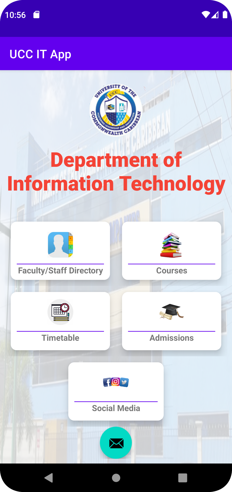

# UCC_IT_App

<!-- ABOUT THE PROJECT -->
## About The Project

This application was created to provide users with access to information, resources, and functions of the University of the Commonwealth Caribbean's (UCC) Department of Information Technology. 

 
The application allows the user to;
1. View Staff of the Faculty/Department along with contact information
2. View information on 10 courses offered by the department
3. See schedule of classes being offering this semester
4. View information on admission requirements for the IT Department, including a link to UCC’s
application page.
5. Access UCC’s Facebook, Twitter, and Instagram accounts
6. Email the head of department

<!-- CONTRIBUTING -->
## Contributing
This application was solely built by 
Name: Christopher Hayden 
ID#: 20211293 
